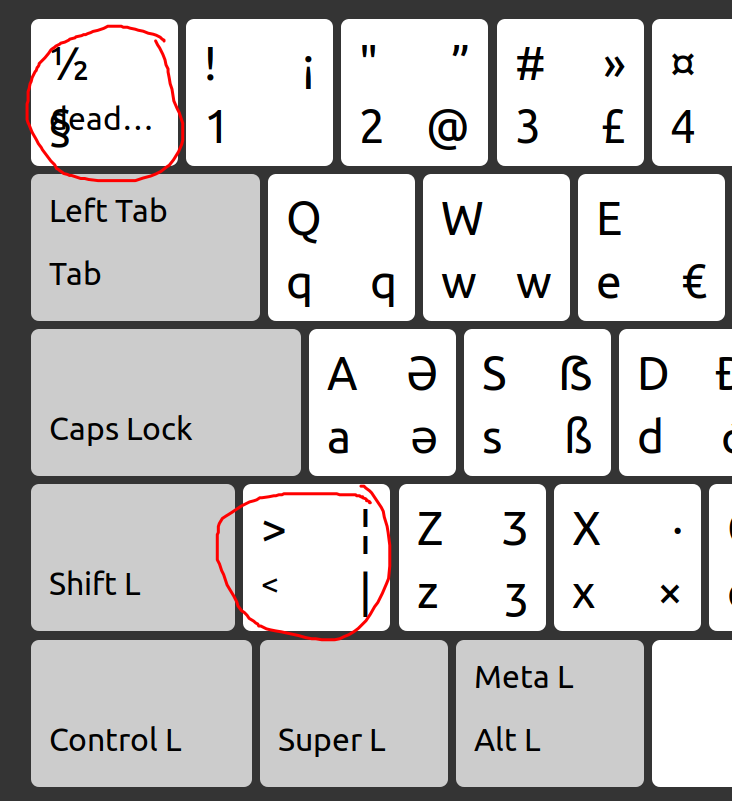

# MX Keys for Mac on Linux

MX Keys for Mac (FI/SWE) keyboard on Linux has the TLDE and LSGT keys reversed (<> and §). This FI configuration file fixes them to the correct positions.



You can customize the file to your taste.

The file can be found in ```/usr/share/X11/xkb/symbols```
